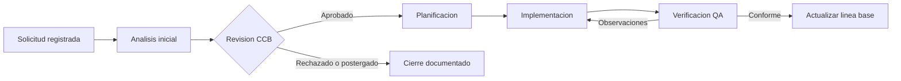

# Flujo de control de cambios

El laboratorio utiliza un flujo breve que separa el registro del cambio, la evaluación del impacto y la validación antes de actualizar la línea base.

## Criterios de transición

- **Registro:** la RFC debe contar con identificador, origen, motivo y prioridad.
- **Análisis:** se revisa el impacto sobre datos, seguridad, operación y usuarios.
- **Revisión CCB:** se decide aprobar, postergar o rechazar el cambio.
- **Implementación:** el cambio aprobado recibe responsable y evidencia de trabajo.
- **Verificación:** se comprueban los criterios de aceptación y la ausencia de regresiones.
- **Cierre:** se actualiza la línea base y se conserva la trazabilidad del cambio.
